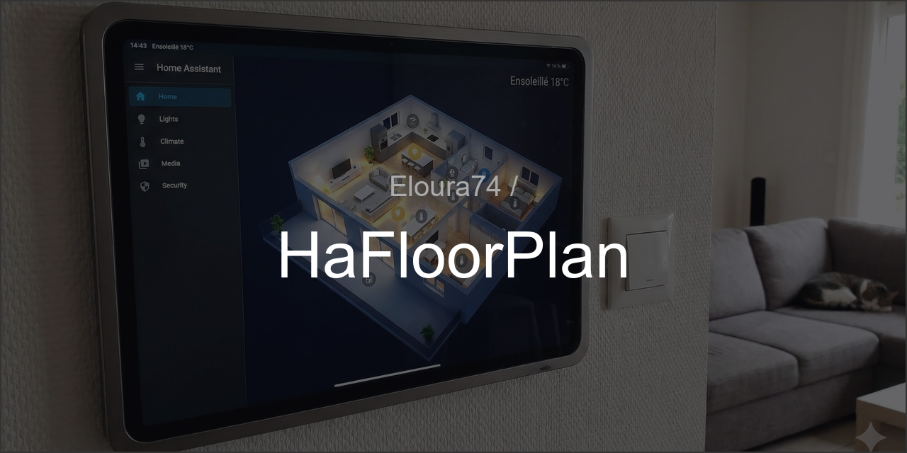

<div align="center">
  
</div>
<br>

# HaFloorPlan

Repo de configuration **Home Assistant** centré sur un **Floorplan** (Lovelace / images / thèmes), avec les fichiers nécessaires pour reproduire l’interface et les automatisations associées.

> ⚠️ Sécurité : **ne jamais committer `secrets.yaml` ni le dossier `.storage/`**.

---

## Objectif

- Versionner proprement :
  - UI (Lovelace / dashboards)
  - Floorplan (assets `/www`)
  - Thèmes
  - Blueprints
  - Config YAML “core” (configuration, scripts, scènes, automations)

---

## Structure du dépôt

- `configuration.yaml` : configuration principale HA
- `automations.yaml` : automatisations
- `scripts.yaml` : scripts HA
- `scenes.yaml` : scènes
- `themes/` : thèmes Lovelace / HA
- `www/` : assets floorplan (images, css, js, icônes, etc.)
- `custom_components/` : intégrations custom (si utilisées)
- `blueprints/` : blueprints HA

Fichiers volontairement **exclus** du versioning :
- `secrets.yaml`
- `.storage/`
- `home-assistant_v2.db`
- logs (`home-assistant.log*`)

---

## Pré-requis

- Home Assistant (OS / Supervised / Container)
- Accès au dossier de configuration HA (`/config` ou équivalent)
- (Optionnel) HACS si tu utilises des cartes custom / intégrations custom

---

## Installation / Déploiement

### Option A — Cloner directement dans le répertoire HA (recommandé si tu gères ça proprement)
1. Se placer dans le dossier de config HA (ex: `/config`)
2. Cloner :
   ```bash
   git clone https://github.com/Eloura74/HaFloorPlan.git .
